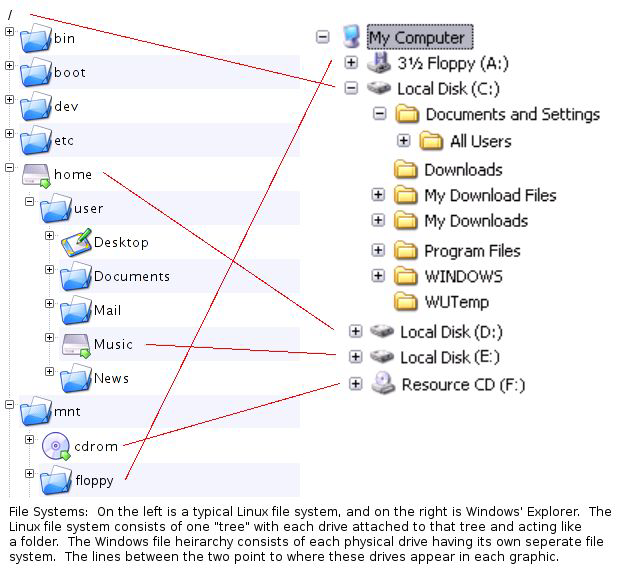
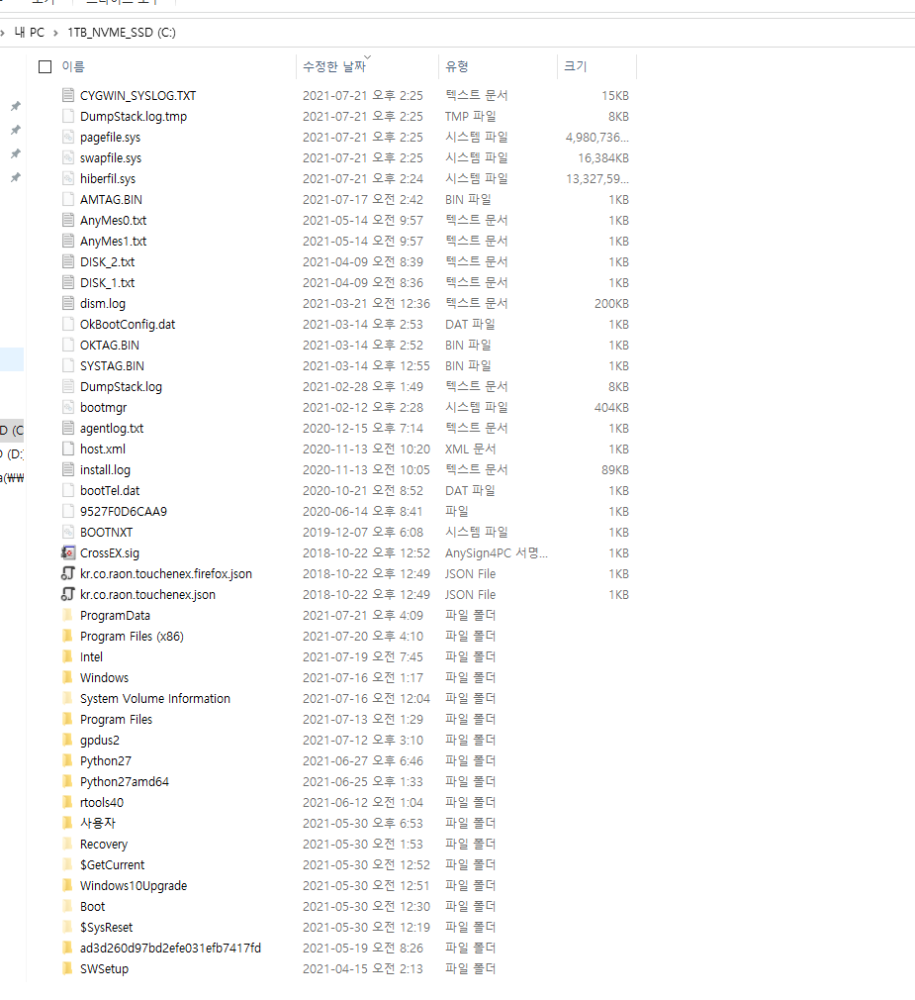

# 데이터 분석을 위한 Linux 명령어

## 유전체 데이터 분석을 위한 필수 BASH 명령

|          |                                       |   |
| :------: | :-----------------------------------: | - |
|  기본 명령어  | 복사/붙여넣기/이름변경/폴더생성, 삭제 경로 이해 등 기본작업 수행 | X |
|  명령어 응용  |  결과물에 \|(파이프라인) 연결을 통한 연결 작업 수행/변수지정  | X |
|  루프/디스크  |      For, while 구조문 / 디스크 연결 및 해제     | X |
|   툴 실행   |       관련 툴 설치 및 실행 방법 / **인터넷**       | X |
| REGEX 기초 |                문자 변환 방법               | x |
|   스크립팅   |               기초 스크립팅 방법              | x |
|  파이프라인화  |            상기 방법들의 연결/자동화 등           | x |

### 리눅스 시스템 구조(참고)

.png>)

### 리눅스 폴더 구조(참고)

.png>)

### 리눅스 윈도우 폴더 구조 비교

