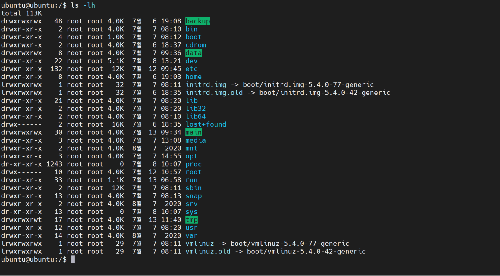
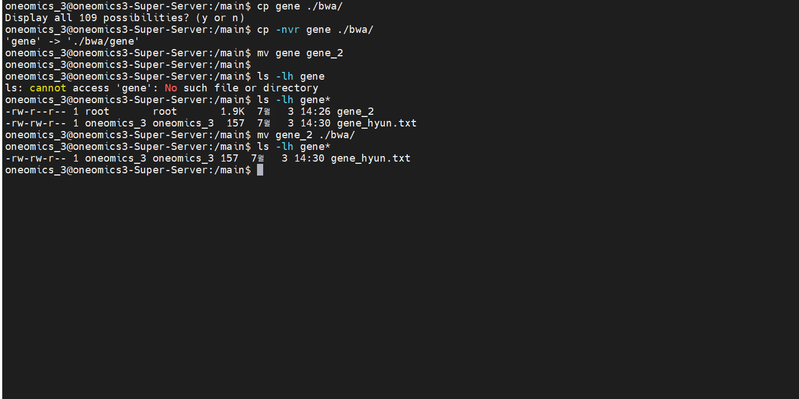

# Linux 운용 및 기본 기능 소개/실습

## 자주 사용하는 명령어 정리 

#### **주 사용 리눅스 명령어 : 따로 설치하지 않고 기본 지원**

_ls, cat, du, df, awk, sed, cut, &gt;, datamash, cp, cd, mv, less, grep, find, dirname, tr, fdisk, mount, top_

_pwd, echo 등_

#### **설치가 필요한 리눅스 명령어 : 편의성을 위해 설치**

_**screen, htop, rename, wget, curl, aria2c**_

_\*\*\*\*_

#### **분석을 위한 리눅스 명령어 : 따로 설치 필요함**

_bwa, samtools, gatk\(java\), \(RAW QC-trimmomatic, trim\_galore\), hisat2 ,star, cufflinks\(R\) 등…_

 ~ = /home/\[자기아이디\] cd ~ , = cd /home/

* **리눅스 최상위 폴더 : / &lt;-&gt; 윈도우 최상위 폴더 : C:\**
* **리눅스 홈 폴더\(윈도우로 치면 User 폴더/내문서/라이브러리 있는곳\) : ~/ &lt;-&gt; /라이브러리, /내문서**

리눅스에서 대부분 작업 폴더는 / 아래에 있습니다. 윈도우에서는 바탕화면/문서를 주로 사용하기 때문에 폴더 구조가 익숙치 않을 수 있는데 리눅스에서도 바탕화면을 볼일이 거의 없을뿐 기본 구조는 비슷 합니다. 보통 로그인을 하면 ~\(물결\) 에 떨어지는데

* 폴더 사이 옮겨 다니기
* 리눅스 폴더구조

상대경로 ./ = 현재 폴더, ../ 바로 위에 폴더

ls -lha

상대폴더- 현재 내가 있는 폴더 기준 . = 내폴더 .. = 바로 앞 폴더

cat ./file.sh

cd ..

cat ./여기있는 파일

cat ../바로앞 폴더에 있는 파일.

ls -lh ./

ls -lh ../

cat **./**

java -jar snpeff.jav fdfdf &gt; **./**file.txt

절대폴더- 명확함 /home/main/df/ddfdf/

/home/main/

절대경로 /main/ , /backup

예시\) ls -lh ./ \(./ 를 생략해도 되나 습관적으로 붙이는게 편합니다\)

cd / : 최상위 폴더 \(대부분 폴더 및 파일이 위치\)

cd /main : 작업 폴더

cd /backup : Rawdata 폴더

cd ../ : 바로 위에\(전\) 폴더로 이동

find ./ -name “파일명” \(루트권한 얻으셔서\)

폴더 내부 파일 보기

ls -lh \(ls 리스트, l 세로보기, h 용량에 단위수\)

ls -lhrt \( t 시간순, r 거꾸로 보기\)

* **복사 붙여넣기 이름변경 삭제 파일찾기 폴더생성 / cp, mv, mv, rm, find**

cp \[원본\] \[옮길곳\], cp -nvr\(r:내부 폴더 까지 전부, v: 카피 중인 파일, n: 파일 존재시 카피 안함\)

이름변경\) n = 겹치는거 카피 안함 / v = 카피되는 상태 / r = 폴더이동

**mv \[바꿀파일\] \[바뀔이름\]**

**mv \[옮길파일\] \[옮겨질폴더\]**

mv = move ,

mv \[있는파일\] \[있는파일의 바뀔이름\] -&gt; mv text.txt text\_2.txt \(이름변경\)

.

. 

rm \[삭제할 파일\], rm -r \[삭제할 폴더/폴더 아래까지 전부 삭제\]

**find /home/ -maxdepth 1 -name “\[찾을파일\]/REGEX사용가능”** -type \[d/f\]

mkdir \[생성할 폴더 이름\]

**mkdir -p** \[생성할 폴더 이름\]/\[생성할 폴더 이름\]/\[생성할 폴더 이름\]/… 최종 폴더 아래까지 전부 생성

**\(\*REGEX, 문자열에 나타는 특정 문자 조합과 대응시키기 위해 사용되는 패턴\)**

ex\) find -name “\[0-9\]test\[0-9\]”

* **“\|” 파이프라인의 응용**

파이프라인은 출력되는 텍스트를 바로 내보내지 않고 \| 다음 명령어로 넘겨 받어 처리하는 개념

명령어를 실행시켜 텍스트가 나오는 경우 대부분 파이프라인\(\|\) 을 지원합니다.

**cat \[파일명\] : 파일의 내부 텍스트 출력\(zcat-gzip/”bcftools-only\_vcf”-&lt;1%\)**

**cat \[파일명\] \| less : 출력되는 텍스트를 붙잡어 less로 잡아서 스크롤 가능하게 만듬  
\(-S 옵션 : 스트레치, 한줄을 옆으로 끝까지 붙잡아서 출력\)**

**cat \[파일명\] \| grep “문자열” : 출력되는 텍스트에서 특정 문자열을 표시**

\(grep 은 -o, -w, -c, -E 옵션 등 여러 응용방법이 존재\) + sed,awk

**find -name “파일명”**

**find \[찾기 시작할 폴더 = /, ~\]-name “파일명” -type d\(폴더\)/f\(파일만\)**

**find \[찾기 시작할 폴더 = /, ~\]-name “파일명” \| grep “문자열” \| less 등으로 응용 가능**

* **변수지정**

Bash 는 시스템 관리용으로 개발되어 언어적 스크립팅이 가능하도록 설계되어 명령어와 변수 선언이 혼재되어 있습니다.

변수명 : **변수선언/지정**

**LINUX 시스템에서 관리하는 변수명을 제외, 특수 문자, 스페이스 등을 제외 후 설정 가능**

**a=”test” / a라는 변수에 “test”라는 문자를 넣어줌\(선언\)**

**b=”123” / b라는 변수에 “123”이라는 문자를 넣어줌**

**echo “이툴은 ---만들었습니다” -&gt; “ “ 안에 담긴 것을 출력해주거나,**

**echo ${a} ${b} -&gt; 변수에 설정된 것을 꺼내서 출력 해줌**

**history : 접속 후 친 명령어들을 보여주며 시간대별로 정렬이 되어 있음**

* **For, while 구조문 / 디스크 연결 및 해제**

For/While 문은 loop 구조 \(**같은일을 여러번 반복 할 수 있음\)**

**/모든 프로그래밍 언어가 전부 탑재**

**/형식 다 다르고, while -&gt; 잘못쓰면 -&gt; 코딩이 안꺼지 반복**

\(참조 : [https://taepcsiandwe.tistory.com/entry/Bash-For-Loop-%EC%98%88%EC%A0%9C](https://taepcsiandwe.tistory.com/entry/Bash-For-Loop-%EC%98%88%EC%A0%9C)\)

\(참조 : [https://blog.leocat.kr/notes/2018/02/17/shell-looping-list](https://blog.leocat.kr/notes/2018/02/17/shell-looping-list)\)

구조\) **for-do-done**구조로 이루어져 있습니다.

for \[내가 지정한 변수\] in 1 2 3 4 5

do

\(반복할 작업\)

done

예시.1\)

예시.2\) {시작..끝..증감}

예시.3\) 응용

**\* find \[찾기 시작할 폴더 = /, ~\]-name “파일명” \| grep “문자열” 등으로 응용 가능**

**\*\*$\( \)**

**for file in $\(find -name “파일명” \| grep \)**

**do**

**echo “${file}”**

 **툴 실행 ${file}**

**done**

**\(참조 :** [**https://mkblog.co.kr/2018/10/05/bash-while-loop-example/**](https://mkblog.co.kr/2018/10/05/bash-while-loop-example/)**\)**

**\(참조 : https://www.cyberciti.biz/faq/bash-while-loop/\)**

1. **while 문 / 조건식이 만족하는 동안 실행이 되기 때문에 while 이라는 문법이 사용 됩니다. 약간 발전된 for 문으로 기본적으로 for 문에서도 같은 결과를 내 수 있도록 구현이 가능 하며, 취향이나 편의성에 따라 두개가 같이 사용 됩니다.**

기본적인 구조는

while

do

\(실행문\)

done

으로 for 문과 똑같습니다.

하지만 for 문에 비해 몇가지 추가적인 기능이 제공 됩니다.

1. while \[ 조건문 \]; do 명령어;done 구조

x=1

**while** **\[** $x -le 5 **\]**

**do**

 **echo** "Welcome $x times"

 x=$**\(\(** $x + 1 **\)\)**

**done**

* **관련 툴 설치 및 실행 방법 / 인터넷**

1. 툴 설치 및 실행 방법 \(간략버전\)

* **C 언어 소스코드를 Make 로 설치하는 방법**

1. **다운로드 – 압축해제 – make 로 컴파일 후 설치, htslib-&gt;make / 어떻게 만들어라 -&gt; 메뉴얼**
2. **wget** [**https://github.com/samtools/samtools/releases/download/1.13/samtools-1.13.tar.bz2**](https://github.com/samtools/samtools/releases/download/1.13/samtools-1.13.tar.bz2)

* Python 기반의 PIP 로 설치하는 방법

1. pip install 사용/ ie\) pip2 또는 pip3 트라이 가능\(파이쏜 버전에 따름\) https://pypi.org/project/pandas2/
2. 

* **R 기반의 package install 로 설치하는 방법**

**..\(공식서버\)install.packages\(“ “\)사용 / \(“Bioconductor”\) -&gt; 툴설치 \(인터넷\)**

* **리눅스에서 기본 제공하는 apt 를 사용하는 방법**

**..apt install \[툴이름\]**

* git clone 의 사용 방법

..git clone \[툴\]

* **java 기반의 툴 실행**

**..java -jar \[자바프로그램\] .jar**

* 이외 perl 등의 설치가 있으나 시간이 너무 오래 지난 툴인 관계로 \(써디파티\) conda install 로 대체 합니다. Conda 는 스크립트 시 실행 해 볼 예정
* PATH 잡는 방법 :
* PATH 를 잡는 이유는 툴을 다른 폴더에서 좀 더 편리하게 Full path 를 쓰지 않고 사용할 수 있습니다.
* export PATH=/main/PHY/samtools-1.13:/main/PHY/bcftools-1.13**:/${PATH}**

\(참고 : [https://m.blog.naver.com/occidere/220821140420](https://m.blog.naver.com/occidere/220821140420)\)

* **디스크 탈착/부착**
* **리눅스의 경우** 모든 디스크가 파일/폴더 개념으로 관리가 됩니다. mount 잡아줘야합니다. -&gt; 현재 시스템 사용하시는게-&gt; 다 잡혀있어서 -&gt; 실습-&gt;USB\[마운트\]
* **외장하드로**
* 윈도우에서 USB를 꼽으면 드라이브가 자동으로 배정되고 화면이 뜨는데

리눅스에서는 비슷한 기능이 있기는 하나 동작이 윈도우처럼 완벽하지는 않습니다.

 mount -l 명령어는 현재 시스템에 접속해있는 디스크의 list 를 보여주는데 상당히 복잡합니다. 대부분 리눅스에서 가상으로 관리하는 디스크로 mount -l \| grep “/dev”

명령어를 사용하면 그나마 실제 사용되는 디스크들을 볼 수 있습니다.

/dev/sda,b.. sde/sdf 이런것들

on 이후에 있는 것들이 실제 cd 로

/ 폴더는 시스템의 맨 상위 폴더이며

/main 은 /dev/sdb1 이 접속되어 있는 폴더 입니다.

![Linux\] &#xB9AC;&#xB205;&#xC2A4; &#xD30C;&#xC77C;&#xC758; &#xC885;&#xB958;&#xC640; &#xB514;&#xB809;&#xD1A0;&#xB9AC; &#xAD6C;&#xC870;](../.gitbook/assets/36.png)

폴더의 구조를 다 외울 필요는 없습니다. 일반적으로 작업에 필요한 폴더만 기억하시면 됩니다.

상기 그림은 참고만 삼아 보시면 됩니다.

sda, sdb, sdc, sdd

알파벳이 바뀌면 디스크가 바뀌는것이고,

sda1, sda2, sda3 처럼 숫자가 바뀌면 한게 디스크에서 여러개로 갈려 있는 형태 입니다.

윈도우에서

“diskmgmt.msc” 명령어를 치면 하기와 같은 화면이 나오는데

**디스크 0 = sda**

디스크0의 1번 은 sda1 = 600MB,

디스크0의 2번 은 sda2 =1TB\_NVME\_SSD

**디스크 1 = sdb**

로 이해하시면 편합니다.

fdisk 명령어 는 디스크 구조 변경 파티션 삭제 등을 할 수 있으나, 시스템에 접속한 하드웨어를 볼 수 있습니다.

 **일반적으로 사용되는 명령어는 fdisk -l 명령어로 이를 사용하면 현재 접속된 모든 디스크를 볼 수 있습니다. 해당 리스트업에서 /dev/sda1, /dev/sdb1\(현재 화면에는 없음\), /dev/sdc1\(현재 화면에는 없음\)… 등을 볼 수 있으며 해당 디바이스 주소를 기반으로 마운트 할 수 있습니다.**

 **보통,**

1. **상기 리스트에서 주소를 찾은 후,**
2. **mount /dev/sda1 \[해당 폴더\] 로 마운트 작업을 진행 합니다.**
3. **umount /dev/sda1**
4. **umount \[해당 폴더\]**
5. **3,4 가 안되는 경우 umount -f /dev/sda1 또는 \[해당폴더\] 로 시도가 가능하며 \(-f 강제옵션\), 보통 안되는 경우 해당 폴더 내부에 파일을 사용하고 있거나 모든 사용자가 빠지지 않아서 발생합니다**
6. **디스크 삽입 및 제거는 작업중인 일에 영향을 줄 수 있어 조심하게 작업하셔야 합니다.**

