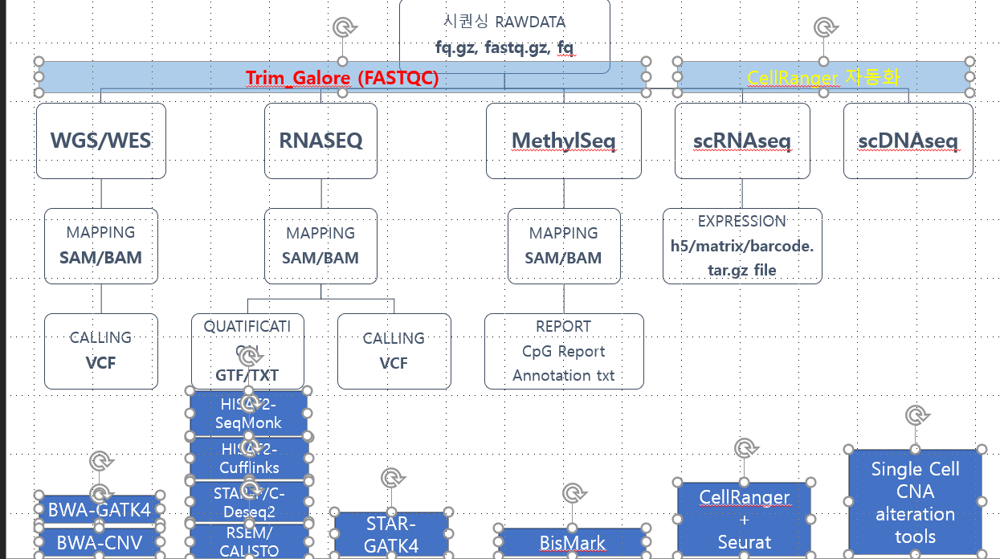

# 4. NGS 기본

## NGS  - Wet Lab : Sample QC / Library QC / LIBRARY LOADING 

.png>)

.png>)

.png>)

.png>)

.png>)

.png>)

.png>)

.png>)

.png>)

.png>)

.png>)

.png>)

.png>)

.png>)

.png>)

.png>)

.png>)

.png>)

.png>)

.png>)

.png>)

.png>)

.png>)

.png>)

.png>)

.png>)

.png>)

.png>)

.png>)

## NGS - Genome Data 분석 파트 

### 분석공통 : Rawdata 소개 및 처리 

#### Raw data소개 

Rawdata  는 일반적으로 fastq 파일 fq 파일로 되어 있습니다. 

fastq 파일 또는 fq 파일은 텍스트 파일로 Fasta Quality 파일의 약자 입니다. fasta 파일은 과거에 사용되었던 포맷으로 현재에는 주로  래퍼런스 파일로 사용되고 있습니다. fasta/fastq 파일 형식은 파일을 담는 방법의 큰 틀만 정의 하고 있으며 상세 내용은 내용물을 확인 하셔야 합니다. 두개 형식은 아직 혼용이 되고 있으나 시퀀싱 이후 받는 정보는 대부분 fastq 파일인 경우가 많습니다.

FASTA 는 간단한 형식으로 한개의 Gene / Chromosome / BAC 등을 기재 할 수 있으며 어떤 종류가 와도 상관은 없습니다.

.png>)

.png>)

FASTQ 파일 quality score 가 포함되어 있는 형식으로 각 시퀀스 별로 얼마나 시퀀싱이 제대로 되었는지 점수 정보를 포함 하고 있습니다. 점수 정보의 경우 플랫폼 별로 메기는 방식이 다르기 때문에 같은 fastq 파일이라도 다른 시퀀싱 기기를 이용하는 경우 호환이 되지는 않습니다. 

.png>)

참고.1) [https://compgenomr.github.io/book/fasta-and-fastq-formats.html](https://compgenomr.github.io/book/fasta-and-fastq-formats.html)\

#### Rawdata 트리밍 작업 

Fastq 파일은 실험을 진행하며 필요없는 서열이 다량 포함되어 있습니다. 기본적인 Quality 는 시퀀싱 기기에서 demultiplexing 을 진행할때 어느 정도 보장이 되나 필요없는 서열이 포함되어 있을 수 있습니다.

샘플 prep 시 간략하게 정리하면,\
1\) 샘플 자체 문제 : 샘플 자체에서 Contamination 이 발생한 경우 - 실험 목적과 관계 없는 서열 포함(사람이면 BAC 시퀀스, DNA Seq 이면 RNA 서열, RNA seq 인 경우 DNA 서열 등)\
2\) 실험상 문제 :  PCR Duplication, 어댑터 서열, 바코드 서열등이 포함

상기 문제점을 해결하기 위해 Fastq QC 를 수행 합니다.\

.png>)

참고.1) [https://genomics.sschmeier.com/ngs-qc/index.html](https://genomics.sschmeier.com/ngs-qc/index.html)

fastqc 툴은 매우 다양한 툴이 존재하나 성능이 비슷하기 때문에 어떤 툴을 사용해도 일반적으로 크게 상관은 없습니다. 하지만 특수한 application 을 사용하는 경우 민감한 부분이 있을 수 있으 분석하는 샘플이 어떤 qc 를 필요로 하는지  사전에 꼭 확인은 해야 합니다.\
\
분석의 특성상 잘못된 QC 를 택하는 경우 최종 결과에서 이상함을 확인 할 수 있으니 일반적인 DNA, RNA Seq 이외 또는 일루미나 이외의 application 의 경우 (SMRT, Oxford Nanopore 등) 확인을 꼭 하시길 바랍니다.\
\
fastqc 를 하는 이유는 Mapping 시( reference 에 조각난 DNA들을 맞출 시 )\
\
대표적인 툴을 하기와 같습니다.

1\) Trim_galore(cutadapt + fastqc 포함)\
[https://www.bioinformatics.babraham.ac.uk/projects/trim_galore/](https://www.bioinformatics.babraham.ac.uk/projects/trim_galore/)\
2\) Trimmomatic\
[http://www.usadellab.org/cms/?page=trimmomatic](http://www.usadellab.org/cms/?page=trimmomatic)\
국문 - 해석시 참고하세요.) [https://m.blog.naver.com/alsdo0524/221448390423](https://m.blog.naver.com/alsdo0524/221448390423)\
\
FASTQC 해석시 - 상기 국문 블로그에 +첨\
\

.png>)

1\) Quality Score 가 Sanger / Illumina 1.9 Encoding 확인 - 과거 데이터의 경우 포맷이 달랐으며 Score 에 영향을 미쳤습니다. 특히 2015년 이전 시퀀싱 한 데이터는 확인이 필요 합니다.\
 2\) 일루미나 Short reads 특성상 뒷부분이 무너지며 Reads2 의 경우 더 무너지는게 정상입니다. \
기본적으로 요즘에는 회사에서 어느 정도 보정을 해서 나옵니다.

### 결과물)

1\. 주요 결과물 : Trimmed 된 fastq 파일\
2\. 부수 결과물 : QC 된 Plot 등 (fastqc 파일 )

##  

### Whole Transcriptome Sequencing (WTS), Whole RNA Sequencing/Bulk RNA Sequencing

