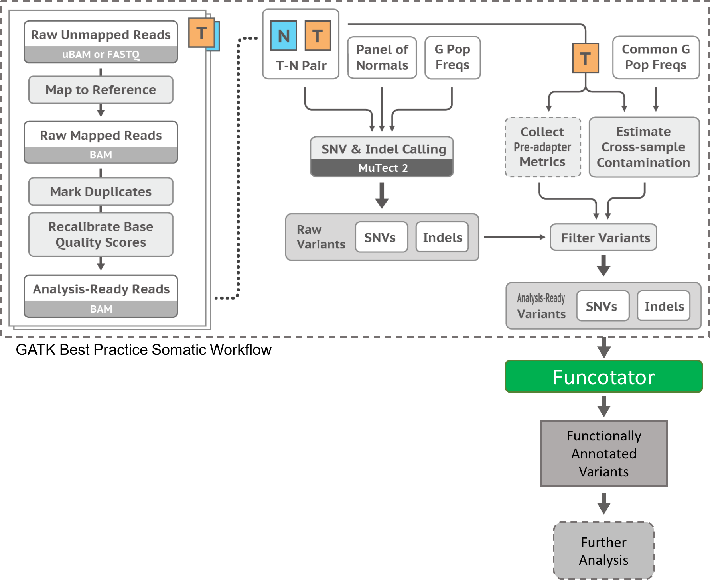

# GATK - Mutect2 Pipeline

## 분석개요



Mutect2 실행\
1\) BAM 파일 두개 -> Input\
2\) 대부분 비교 분석 파이프라인\
3\) ** Tumor with matched normal : "두 개 샘플이 매치 되는 경우"**\
**4) **[**https://gatk.broadinstitute.org/hc/en-us/articles/360051306691-Mutect2**](https://gatk.broadinstitute.org/hc/en-us/articles/360051306691-Mutect2)****\
****

.png>)

****

****

예시 스크립트 - 서버 상 실행 ) 

```
java -jar /main/program/gatk-4.2.1.0/gatk-package-4.2.1.0-local.jar Mutect2 -R /main/references/hg38/hs38.fa -I /main/test_analysis/raw_data_wgrs/p22-hFSiPS1/mapped/p22-hFSiPS1_sorted.bam -I /main/test_analysis/raw_data_wgrs/p33-CDDO0nM/mapped/p33-CDDO0nM_sorted.bam -normal p22-hFSiPS1 --output ./mutation.vcf.gz 
```


Mutect2 pipeline\
\-R : 래퍼런스 파일\
\-I : 순서 관계 없이 Cancer 또는 Normal BAM\
\-I : 순서 관계 없이 Cancer or Normal BAM\
\--germline-resource :  GATK4.2.1.0 resource bundle 제공\*\
([https://console.cloud.google.com/storage/browser/gatk-best-practices/somatic-hg38](https://console.cloud.google.com/storage/browser/gatk-best-practices/somatic-hg38) / germline resource bundle) / 차후 분석시 파일 지정 해 주셔야 합니다.\
\-normal : Normal SAMPLE 의 bam 파일 헤더에 적힌 sample 명(파일명X)\
\--panel-of-normals : 싱글 샘플인 경우 관계 없음(여러 코호트의 Normal VCF 제작)


```
$ gsutil cp gs://gatk-best-practices/somatic-hg38/af-only-gnomad.hg38.vcf.gz ./
```


## Mutect2 cancer data 필터링 과정

GATK 4.1.1.0 Mutect2  버전 부터 하기 필터링 파이프라인으로 변경 되었습니다.


[https://gatk.broadinstitute.org/hc/en-us/articles/360035531132](https://gatk.broadinstitute.org/hc/en-us/articles/360035531132)


단순한 Filtration / 분석 중 만들어 낸 Stat 파일 기반의 Filtering 

```
java -jar /main/program/gatk-4.2.1.0/gatk-package-4.2.1.0-local.jar FilterMutectCalls -R /main/references/hg38/hs38.fa -V ./mutation.vcf.gz -O ./mutation.filtered.vcf.gz
```


## 참고자료 

1\) [https://gatk.broadinstitute.org/hc/en-us/articles/360035889931-Funcotator-Information-and-Tutorial](https://gatk.broadinstitute.org/hc/en-us/articles/360035889931-Funcotator-Information-and-Tutorial)

2\) [https://gatk.broadinstitute.org/hc/en-us/articles/360035889791--How-to-Call-somatic-mutations-using-GATK4-Mutect2-Deprecated-](https://gatk.broadinstitute.org/hc/en-us/articles/360035889791--How-to-Call-somatic-mutations-using-GATK4-Mutect2-Deprecated-) (과거 filtering) 방법
